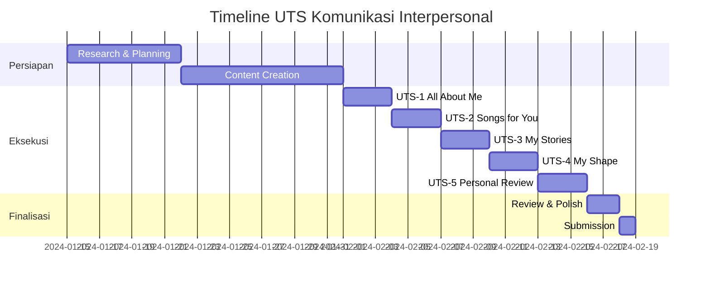

# 📋 UTS Overview - Komunikasi Interpersonal

## 🎯 Tujuan Pembelajaran

Mata kuliah Komunikasi Interpersonal bertujuan untuk:
- Mengembangkan pemahaman mendalam tentang diri sendiri
- Meningkatkan kemampuan komunikasi dengan orang lain
- Membangun keterampilan empati dan mendengarkan aktif
- Mengevaluasi dan merefleksikan perkembangan komunikasi personal

---

## 📚 Struktur Tugas UTS

### 🔗 Quick Navigation

| No | Tugas UTS | Fokus Utama | Link |
|----|-----------|-------------|------|
| 1 | **All About Me** | Daya Tarik Personal | [📄 UTS-1](UTS-1-All-About-Me.md) |
| 2 | **Songs for You** | Ekspresi Kreatif | [🎵 UTS-2](UTS-2-Songs-for-You.md) |
| 3 | **My Stories for You** | Storytelling Inspiratif | [📖 UTS-3](UTS-3-My-Stories-for-You.md) |
| 4 | **My Shape** | Analisis Kepribadian | [🔍 UTS-4](UTS-4-My-Shape.md) |
| 5 | **My Personal Review** | Self & Peer Assessment | [⭐ UTS-5](UTS-5-My-Personal-Review.md) |

---

## 🏆 Kriteria Penilaian Umum

### ⭐ Aspek yang Dinilai

> [!success] **Konten & Substansi (40%)**
> - Kedalaman refleksi dan analisis
> - Kualitas ide dan originalitas
> - Relevansi dengan teori komunikasi interpersonal

> [!info] **Presentasi & Format (30%)**
> - Struktur dan organisasi konten
> - Penggunaan media dan visual
> - Kerapihan dan profesionalisme

> [!tip] **Komunikasi Efektif (30%)**
> - Kejelasan penyampaian pesan
> - Kemampuan storytelling
> - Engagement dengan audience

---

## 📊 Timeline & Deadline



---

## 💡 Tips Sukses UTS

### 🎯 Strategi Persiapan

> [!warning] **Persiapan Awal**
> 1. **Self-reflection mendalam** - Luangkan waktu untuk mengenal diri
> 2. **Kumpulkan materi** - Foto, video, dokumen pribadi yang relevan
> 3. **Buat timeline** - Jangan menunda hingga mendekati deadline

> [!tip] **Eksekusi Efektif**
> 1. **Authenticity first** - Jadilah diri sendiri yang sesungguhnya
> 2. **Tell compelling stories** - Gunakan narrative yang menarik
> 3. **Visual storytelling** - Manfaatkan gambar dan media dengan baik

> [!note] **Finalisasi**
> 1. **Peer review** - Minta masukan dari teman sebelum submit
> 2. **Proofreading** - Periksa grammar dan typo
> 3. **Technical check** - Pastikan semua link dan media berfungsi

---

## 🔄 Interconnection Antar Tugas

```
UTS-1 (All About Me) 
    ↓ Membangun fondasi self-awareness
UTS-2 (Songs for You) 
    ↓ Mengekspresikan emosi dan perasaan
UTS-3 (My Stories) 
    ↓ Berbagi pengalaman dan pembelajaran
UTS-4 (My Shape) 
    ↓ Menganalisis hasil asesmen formal
UTS-5 (Personal Review) 
    ↓ Mengevaluasi keseluruhan perjalanan
```

Setiap tugas saling terkait dan membangun pemahaman yang komprehensif tentang komunikasi interpersonal.

---

## 📞 Bantuan & Support

> [!quote] **Kontak Dosen**
> - **Email**: [dosen@email.com]
> - **Office Hours**: Selasa & Kamis, 13:00-15:00
> - **Location**: Ruang Dosen Komunikasi

> [!info] **Peer Support**
> - **Study Group**: Setiap Rabu, 16:00-18:00
> - **WhatsApp Group**: [Link Group Class]
> - **Discord Server**: [Link Discord]

---

*Selamat mengerjakan UTS! Remember, this is your journey of self-discovery and communication growth.* 🌱✨